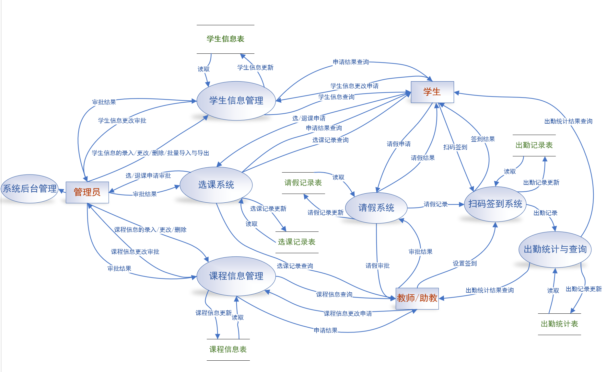
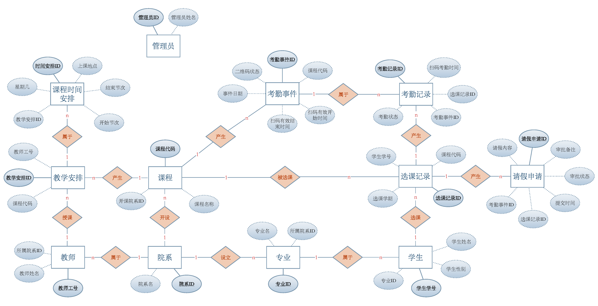

# 微信扫码点名系统 - 数据库设计文档

**小组成员:** 
* 洪家权
* 盖烈森
* 马静
* 陈皓阳

### 1. 引言与项目概述

随着信息技术在教育领域的广泛应用，传统的人工点名方式在效率、准确性和数据管理方面日益显现出不足。在高校中，对大规模课程进行快速、准确、便捷的考勤管理成为了迫切的需求。本项目——"微信扫码点名系统"——旨在构建一套自动化的考勤管理解决方案。

本系统利用微信平台的用户基础，及其扫码接口作为前端签到入口；核心数据，包括学生、课程、教师、考勤及请假记录等，将由后端应用程序依赖健壮的关系数据库进行高效、安全的存储与管理；同时，系统提供 Web 前端界面，支持各类用户（学生、教师、管理员）进行信息查询、管理操作（增删改）等交互，并能直观地展示所需的考勤统计结果。通过整合这些技术，期望能显著提升考勤效率，减少人为错误，并为教学管理提供有效的数据支持。

本文档作为该系统数据库设计的详细说明，将遵循数据库设计的基本原则与规范，从概念模型（E-R图、实体、关系）到逻辑与物理模型（表结构、数据类型、约束条件、范式分析），全面阐述数据库的设计思路、结构和具体实现细节，为后续的系统开发和数据库建立提供清晰的蓝图和依据。


### 2. 需求分析概要

本系统围绕学生、教师和管理员三类用户的交互展开，满足他们在考勤、教学、管理等方面的核心需求，并需要对相关的核心数据进行有效管理。


#### 2.1 数据流图



#### 2.2 用户角色及核心功能

* **学生 (Student):**
    * **扫码签到:** 在教师发起的考勤事件有效时间内，使用微信扫描指定二维码完成签到。
    * **请假申请:** 针对特定的考勤事件，在线提交请假申请及理由。
    * **信息查询:** 查看个人基本信息、选课列表、课程表（上课时间、地点）、历史考勤记录以及请假申请的审批状态。
    * **选课操作:** [可能功能] 执行选课、退课操作（具体流程根据系统实现，可能由管理员直接处理）。

* **教师 (Teacher):**
    * **发起与管理考勤:** 为所授课程创建（发起）考勤事件，设置有效扫码时间窗口，系统据此生成二维码（以事件ID为内容）供展示。可将考勤事件设为有效或无效状态。
    * **查看考勤结果:** 实时或事后查看指定考勤事件的学生签到详情（出勤、缺勤、请假名单及时间）。
    * **请假审批:** 审核名下学生提交的请假申请，进行批准或驳回操作，并可添加备注。
    * **信息查询:** 查看个人基本信息、所授课程列表及详细的课程时间安排。

* **管理员 (Admin):**
    * **基础信息管理:** 在后台管理系统维护院系、专业、学生、教师、课程等基础信息（执行增、删、改操作）。
    * **教学安排管理:** 管理教师的教学任务分配（TeachingAssignment）以及具体的课程时间安排（ClassSchedule）。
    * **选课管理:** 在后台直接处理学生的选课记录（Enrollment），包括添加、删除（处理中途选/退课）。
    * **数据监控与统计:** 查询、浏览院系或课程范围内的考勤数据统计结果（如出勤率、缺勤名单等，由系统根据原始考勤记录动态生成报表或视图）。
    * **[可能功能] 系统设置:** 配置系统级参数（例如默认的考勤有效时长等）。

#### 2.3 主要数据需求

为实现上述功能，数据库需要存储和管理以下核心信息：

* **组织与人员:** 院系 (Department)、专业 (Major)、学生 (Student)、教师 (Teacher)、管理员 (Admin) 的基本信息。
* **课程与教学:** 课程 (Course) 的基本信息、教师与课程之间的教学安排 (TeachingAssignment)、该安排下的具体上课时间表 (ClassSchedule)。
* **学生与课程关系:** 学生选修课程的记录 (Enrollment)，包含学期信息。
* **考勤核心流程:**
    * 特定日期为某课程发起的考勤事件 (AttendanceEvent)，包含有效时间窗口和状态。
    * 学生针对某次考勤事件的最终考勤记录 (Attendance)，包含状态和扫码时间（如果出勤）。
    * 学生针对某次考勤事件提交的请假申请 (LeaveRequest)，包含原因、提交时间和审批信息（如果实现）。


### 3. 概念模型设计 (Conceptual Model Design)

#### 3.1 E-R 图 (Entity-Relationship Diagram)



#### 3.2 经规范化的实体列表 (Entity List)

1.  **院系 (Department):** 院系ID (PK), 院系名
2.  **专业 (Major):** 专业ID (PK), 专业名, 所属院系ID (FK)
3.  **学生 (Student):** 学生学号 (PK), 学生姓名, 学生性别, 学生专业ID (FK), 微信openid
4.  **课程 (Course):** 课程代码 (PK), 课程名称, 开课院系ID (FK)
5.  **教师 (Teacher):** 教师工号 (PK), 教师姓名, 所属院系ID (FK)
6.  **选课记录 (Enrollment):** 选课记录ID (PK), 学生学号 (FK), 课程代码 (FK), 选课学期
7.  **考勤记录 (Attendance):** 考勤记录ID (PK), 选课记录ID (FK), 考勤事件ID (FK), 扫码考勤时间, 考勤状态
8.  **请假申请 (LeaveRequest):** 请假申请ID (PK), 选课记录ID (FK), 考勤事件ID (FK), 请假内容, 提交时间, 审批状态, 审批备注, 审批教师工号 (FK)
9.  **考勤事件 (AttendanceEvent):** 考勤事件ID (PK), 课程代码 (FK), 扫码有效开始时间, 扫码有效结束时间, 事件日期, 事件状态
10. **管理员 (Admin):** 管理员ID (PK), 管理员姓名
11. **教学安排 (TeachingAssignment):** 教学安排ID (PK), 教师工号 (FK), 课程代码 (FK)
12. **课程时间安排 (ClassSchedule):** 时间安排ID (PK), 教学安排ID (FK), 上课日期, 星期几, 开始节次, 结束节次, 上课地点


#### 3.3 关系描述 (Relationship Descriptions)

1.  设立 (院系 1:N 专业)
2.  属于 (专业 1:N 学生)
3.  属于 (院系 1:N 教师)
4.  开设 (院系 1:N 课程)
5.  选课 (学生 1:N 选课记录)
6.  被选课 (课程 1:N 选课记录)
7.  产生 (选课记录 1:N 考勤记录)
8.  产生 (选课记录 1:N 请假申请)
9.  产生 (课程 1:N 考勤事件)
10. 属于 (考勤事件 1:N 考勤记录)
11. 产生 (课程 1:N 教学安排)
12. 授课 (教师 1:N 教学安排)
13. 属于 (教学安排 1:N 课程时间安排)
14. 教学安排 (课程 N:M 教师) 
    *注：通过实体 11 教学安排 实现*


### 4. 数据库逻辑/物理设计 (Logical/Physical Design)

#### 4.1 表结构定义 (Table Definitions)

```sql
-- 创建数据库
CREATE DATABASE `wx_attendance_db` 
    CHARACTER SET utf8mb4 
    COLLATE utf8mb4_unicode_ci;

-- 实体1: Department (院系信息)
CREATE TABLE `Department` (
  `dept_id` tinyint unsigned NOT NULL AUTO_INCREMENT COMMENT '院系ID',
  `dept_name` varchar(50) NOT NULL COMMENT '院系名',
  PRIMARY KEY (`dept_id`),
  UNIQUE KEY `uk_dept_name` (`dept_name`)
) ENGINE=InnoDB COMMENT='院系信息表';

-- 实体2: Major (专业信息)
CREATE TABLE `Major` (
  `major_id` tinyint unsigned NOT NULL AUTO_INCREMENT COMMENT '专业ID',
  `major_name` varchar(50) NOT NULL COMMENT '专业名',
  `dept_id` tinyint unsigned NOT NULL COMMENT '所属院系ID',
  PRIMARY KEY (`major_id`),
  UNIQUE KEY `uk_major_name` (`major_name`),
  KEY `fk_major_dept` (`dept_id`),
  CONSTRAINT `fk_major_dept` 
    FOREIGN KEY (`dept_id`) REFERENCES `Department` (`dept_id`) 
    ON DELETE RESTRICT ON UPDATE CASCADE
) ENGINE=InnoDB COMMENT='专业信息表';

-- 实体3: Student (学生信息)
CREATE TABLE `Student` (
  `stu_id` char(11) NOT NULL COMMENT '学生学号',
  `stu_name` varchar(50) NOT NULL COMMENT '学生姓名',
  `stu_sex` TINYINT NOT NULL COMMENT '学生性别：1-男，2-女',
  `major_id` tinyint unsigned DEFAULT NULL COMMENT '学生专业ID',
  `openid` varchar(50) NOT NULL COMMENT '微信openid',
  PRIMARY KEY (`stu_id`),
  UNIQUE KEY `uk_student_openid` (`openid`),
  KEY `fk_student_major` (`major_id`),
  CONSTRAINT `fk_student_major` 
    FOREIGN KEY (`major_id`) REFERENCES `Major` (`major_id`) 
    ON DELETE SET NULL ON UPDATE CASCADE
) ENGINE=InnoDB COMMENT='学生信息表';

-- 实体4: Course (课程信息)
CREATE TABLE `Course` (
  `course_id` char(12) NOT NULL COMMENT '课程代码',
  `course_name` varchar(50) NOT NULL COMMENT '课程名称',
  `dept_id` tinyint unsigned NOT NULL COMMENT '开课院系ID',
  PRIMARY KEY (`course_id`),
  KEY `fk_course_dept` (`dept_id`),
  CONSTRAINT `fk_course_dept` 
    FOREIGN KEY (`dept_id`) REFERENCES `Department` (`dept_id`) 
    ON DELETE RESTRICT ON UPDATE CASCADE
) ENGINE=InnoDB COMMENT='课程信息表';

-- 实体5: Teacher (教师信息)
CREATE TABLE `Teacher` (
  `teacher_id` char(5) NOT NULL COMMENT '教师工号',
  `teacher_name` varchar(50) NOT NULL COMMENT '教师姓名',
  `dept_id` tinyint unsigned NOT NULL COMMENT '所属院系ID',
  PRIMARY KEY (`teacher_id`),
  KEY `fk_teacher_dept` (`dept_id`),
  CONSTRAINT `fk_teacher_dept` 
    FOREIGN KEY (`dept_id`) REFERENCES `Department` (`dept_id`) 
    ON DELETE RESTRICT ON UPDATE CASCADE
) ENGINE=InnoDB COMMENT='教师信息表';

-- 实体6: Enrollment (选课记录)
CREATE TABLE `Enrollment` (
  `enroll_id` int unsigned NOT NULL AUTO_INCREMENT COMMENT '选课记录ID',
  `stu_id` char(11) NOT NULL COMMENT '学生学号',
  `course_id` char(12) NOT NULL COMMENT '课程代码',
  `semester` char(6) NOT NULL COMMENT '选课学期',
  PRIMARY KEY (`enroll_id`),
  UNIQUE KEY `uk_enroll_stu_course_sem` (`stu_id`,`course_id`,`semester`),
  KEY `fk_enroll_course` (`course_id`),
  CONSTRAINT `fk_enroll_student` 
    FOREIGN KEY (`stu_id`) REFERENCES `Student` (`stu_id`) 
    ON DELETE CASCADE ON UPDATE CASCADE,
  CONSTRAINT `fk_enroll_course` 
    FOREIGN KEY (`course_id`) REFERENCES `Course` (`course_id`) 
    ON DELETE CASCADE ON UPDATE CASCADE
) ENGINE=InnoDB COMMENT='选课记录表';

-- 实体9: AttendanceEvent (课堂考勤事件)
CREATE TABLE `AttendanceEvent` (
  `event_id` int unsigned NOT NULL AUTO_INCREMENT COMMENT '考勤事件ID',
  `course_id` char(12) NOT NULL COMMENT '课程代码',
  `event_date` date NOT NULL COMMENT '事件日期',
  `scan_start_time` time NOT NULL COMMENT '扫码有效开始时间',
  `scan_end_time` time NOT NULL COMMENT '扫码有效结束时间',
  `event_status` TINYINT NOT NULL DEFAULT 1 COMMENT '二维码/事件状态：1-有效，2-无效',
  PRIMARY KEY (`event_id`),
  KEY `fk_event_course` (`course_id`),
  CONSTRAINT `fk_event_course` 
    FOREIGN KEY (`course_id`) REFERENCES `Course` (`course_id`) 
    ON DELETE CASCADE ON UPDATE CASCADE
) ENGINE=InnoDB COMMENT='课堂考勤事件表';

-- 实体7: Attendance (考勤记录)
CREATE TABLE `Attendance` (
  `attend_id` int unsigned NOT NULL AUTO_INCREMENT COMMENT '考勤记录ID',
  `enroll_id` int unsigned NOT NULL COMMENT '选课记录ID',
  `event_id` int unsigned NOT NULL COMMENT '考勤事件ID',
  `scan_time` datetime DEFAULT NULL COMMENT '扫码考勤时间',
  `status` TINYINT NOT NULL COMMENT '考勤状态：1-出勤，2-缺勤，3-请假',
  `notes` text COMMENT '备注',
  PRIMARY KEY (`attend_id`),
  UNIQUE KEY `uk_attend_enroll_event` (`enroll_id`,`event_id`),
  KEY `fk_attend_event` (`event_id`),
  CONSTRAINT `fk_attend_enroll` 
    FOREIGN KEY (`enroll_id`) REFERENCES `Enrollment` (`enroll_id`) 
    ON DELETE CASCADE ON UPDATE CASCADE,
  CONSTRAINT `fk_attend_event` 
    FOREIGN KEY (`event_id`) REFERENCES `AttendanceEvent` (`event_id`) 
    ON DELETE CASCADE ON UPDATE CASCADE
) ENGINE=InnoDB COMMENT='学生考勤记录表';

-- 实体8: LeaveRequest (请假申请)
CREATE TABLE `LeaveRequest` (
  `leave_request_id` int unsigned NOT NULL AUTO_INCREMENT COMMENT '请假申请ID',
  `enroll_id` int unsigned NOT NULL COMMENT '选课记录ID',
  `event_id` int unsigned NOT NULL COMMENT '考勤事件ID',
  `reason` text NOT NULL COMMENT '请假内容',
  `submit_time` timestamp NULL DEFAULT CURRENT_TIMESTAMP COMMENT '提交时间',
  `approval_status` TINYINT NOT NULL DEFAULT 1 COMMENT '审批状态：1-待审批，2-已批准，3-已驳回',
  `approver_teacher_id` char(5) DEFAULT NULL COMMENT '审批教师工号',
  `approval_timestamp` datetime DEFAULT NULL COMMENT '审批时间',
  `approver_notes` text COMMENT '审批备注',
  PRIMARY KEY (`leave_request_id`),
  UNIQUE KEY `uk_leave_enroll_event` (`enroll_id`,`event_id`),
  KEY `fk_leave_event` (`event_id`),
  KEY `fk_leave_approver` (`approver_teacher_id`),
  CONSTRAINT `fk_leave_enroll` 
    FOREIGN KEY (`enroll_id`) REFERENCES `Enrollment` (`enroll_id`) 
    ON DELETE CASCADE ON UPDATE CASCADE,
  CONSTRAINT `fk_leave_event` 
    FOREIGN KEY (`event_id`) REFERENCES `AttendanceEvent` (`event_id`) 
    ON DELETE CASCADE ON UPDATE CASCADE,
  CONSTRAINT `fk_leave_approver` 
    FOREIGN KEY (`approver_teacher_id`) REFERENCES `Teacher` (`teacher_id`) 
    ON DELETE SET NULL ON UPDATE CASCADE
) ENGINE=InnoDB COMMENT='请假申请表';

-- 实体10: Admin (管理员)
CREATE TABLE `Admin` (
  `admin_id` char(5) NOT NULL COMMENT '管理员ID',
  `admin_name` varchar(50) NOT NULL COMMENT '管理员姓名',
  PRIMARY KEY (`admin_id`)
) ENGINE=InnoDB COMMENT='管理员信息表';

-- 实体11: TeachingAssignment (教学安排)
CREATE TABLE `TeachingAssignment` (
  `assign_id` int unsigned NOT NULL AUTO_INCREMENT COMMENT '教学安排ID',
  `teacher_id` char(5) NOT NULL COMMENT '教师工号',
  `course_id` char(12) NOT NULL COMMENT '课程代码',
  PRIMARY KEY (`assign_id`),
  UNIQUE KEY `uk_teach_assign_teacher_course` (`teacher_id`,`course_id`),
  KEY `fk_teach_assign_course` (`course_id`),
  CONSTRAINT `fk_teach_assign_teacher` 
    FOREIGN KEY (`teacher_id`) REFERENCES `Teacher` (`teacher_id`) 
    ON DELETE CASCADE ON UPDATE CASCADE,
  CONSTRAINT `fk_teach_assign_course` 
    FOREIGN KEY (`course_id`) REFERENCES `Course` (`course_id`) 
    ON DELETE CASCADE ON UPDATE CASCADE
) ENGINE=InnoDB COMMENT='教学安排表 (Teacher M:N Course)';

-- 实体12: ClassSchedule (课程时间安排)
CREATE TABLE `ClassSchedule` (
  `schedule_id` int unsigned NOT NULL AUTO_INCREMENT COMMENT '时间安排ID',
  `assign_id` int unsigned NOT NULL COMMENT '教学安排ID',
  `class_date` date NOT NULL COMMENT '上课日期',
  `day_of_week` tinyint unsigned NOT NULL COMMENT '星期几',
  `start_period` tinyint unsigned NOT NULL COMMENT '开始节次',
  `end_period` tinyint unsigned NOT NULL COMMENT '结束节次',
  `location` varchar(50) DEFAULT NULL COMMENT '上课地点',
  PRIMARY KEY (`schedule_id`),
  KEY `fk_schedule_assign` (`assign_id`),
  CONSTRAINT `fk_schedule_assign` 
    FOREIGN KEY (`assign_id`) REFERENCES `TeachingAssignment` (`assign_id`) 
    ON DELETE CASCADE ON UPDATE CASCADE
) ENGINE=InnoDB COMMENT='课程时间安排表';