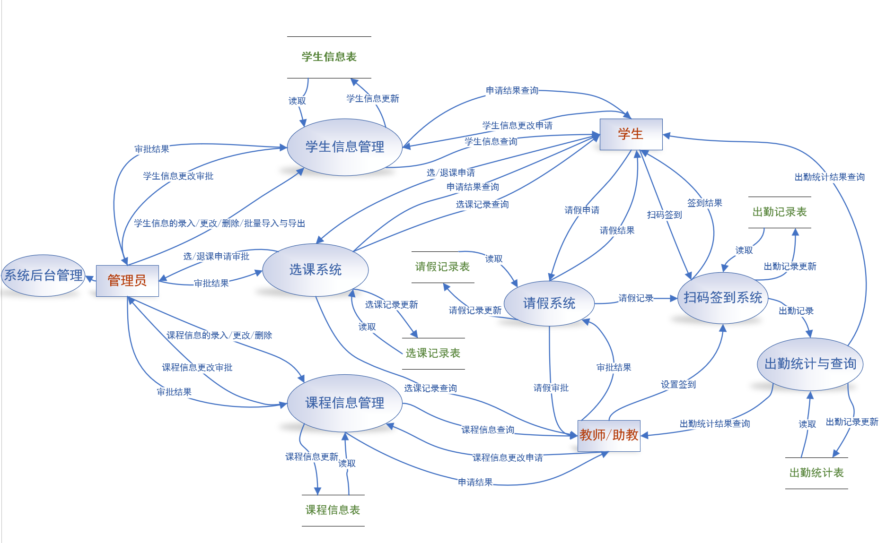
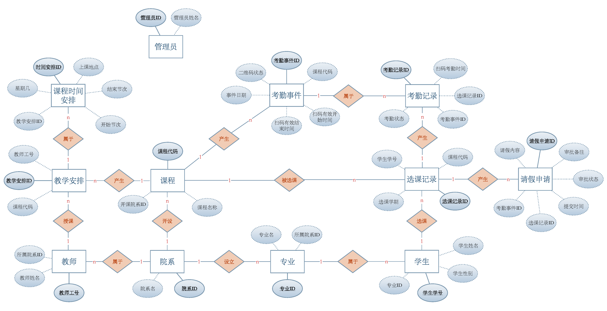

# 微信扫码点名系统 - 数据库设计文档

### 1. 项目概述

随着信息技术在教育领域的广泛应用，传统的人工点名方式在效率、准确性和数据管理方面日益显现出不足。在高校中，对大规模课程进行快速、准确、便捷的考勤管理成为了迫切的需求。本项目——"微信扫码点名系统"——旨在构建一套自动化的考勤管理解决方案。

本系统利用微信平台的用户基础，及其扫码接口作为前端签到入口；核心数据，包括学生、课程、教师、考勤及请假记录等，将由后端应用程序依赖健壮的关系数据库进行高效、安全的存储与管理；同时，系统提供 Web 前端界面，支持各类用户（学生、教师、管理员）进行信息查询、管理操作（增删改）等交互，并能直观地展示所需的考勤统计结果。通过整合这些技术，期望能显著提升考勤效率，减少人为错误，并为教学管理提供有效的数据支持。

本文档作为该系统数据库设计的详细说明，将遵循数据库设计的基本原则与规范，从概念模型（E-R图、实体、关系）到逻辑与物理模型（表结构、数据类型、约束条件、范式分析），全面阐述数据库的设计思路、结构和具体实现细节，为后续的系统开发和数据库建立提供清晰的蓝图和依据。


### 2. 需求分析

本系统围绕学生、教师和管理员三类用户的交互展开，满足他们在考勤、教学、管理等方面的核心需求，并需要对相关的核心数据进行有效管理。


##### 2.1 数据流图



##### 2.2 用户角色及核心功能


**学生 (Student):**

* **扫码签到:** 通过微信在教师发起的考勤事件有效时间内扫描二维码完成签到，系统记录扫码时间和出勤状态。
* **请假申请:** 针对特定考勤事件提交请假申请，填写请假理由，系统记录提交时间并等待教师审批。
* **考勤查询:** 查看个人考勤记录，包括出勤、缺勤、请假状态及统计数据（出勤率、缺勤次数等）。
* **课程信息查询:** 查看已选修课程列表、课程详情、上课时间地点等信息。
* **请假申请:** 查看历史请假申请记录及审批状态（待审批、已通过、已驳回）。
* **个人信息管理:** 查看和修改个人基本信息，修改登录密码。


**教师 (Teacher):**

* **二维码展示:** 系统为有效的考勤事件自动生成二维码，教师可展示给学生扫码签到。
* **考勤结果查看:** 实时查看考勤事件的学生签到情况，包括出勤、缺勤、请假名单。
* **请假审批:** 审核学生提交的请假申请，进行批准或驳回操作，添加审批备注。
* **学生考勤统计:** 查看执教课程中单个学生在指定课程的全部考勤记录和统计数据。
* **课程考勤统计:** 查看执教课程整体考勤情况，即各次考勤事件的出勤率统计。
* **个人信息管理:** 查看和修改个人基本信息，修改登录密码。


**管理员 (Admin):**

* **基础信息管理:** 管理院系、专业、学生、教师、课程等基础信息的增删改查。
* **教学安排管理:** 管理教师与课程的教学任务分配（TeachingAssignment），设置具体的课程时间安排（ClassSchedule）。
* **选课管理:** 管理学生的选课记录（Enrollment），为学生添加选课、删除选课记录。
* **数据统计查询:** 查看全系统考勤数据统计，包括各课程出勤率、学生考勤情况等统计报表。


##### 2.3 主要数据需求

为实现上述功能，数据库需要存储和管理以下核心信息：

* **组织与人员:** 院系 (Department)、专业 (Major)、学生 (Student)、教师 (Teacher)、管理员 (Admin) 的基本信息。
* **课程与教学:** 课程 (Course) 的基本信息、教师与课程之间的教学安排 (TeachingAssignment)、该安排下的具体上课时间表 (ClassSchedule)。
* **考勤核心流程:**
    * 特定日期为某课程发起的考勤事件 (AttendanceEvent)，包含有效时间窗口和状态。
    * 学生针对某次考勤事件的最终考勤记录 (Attendance)，包含状态和扫码时间（如果出勤）。
    * 学生针对某次考勤事件提交的请假申请 (LeaveRequest)，包含原因、提交时间和审批信息。


### 3. 概念模型设计 (Conceptual Model Design)

##### 3.1 E-R 图 (Entity-Relationship Diagram)


* 真实模型较上述图片略有修改

#### 3.2 经规范化的实体列表 (Entity List)

1.  **院系 (Department):** 院系ID (PK), 院系名
2.  **专业 (Major):** 专业ID (PK), 专业名, 所属院系ID (FK)
3.  **学生 (Student):** 学生学号 (PK), 学生姓名, 学生性别, 学生专业ID (FK), 微信openid, 关联用户账号ID (FK)
4.  **课程 (Course):** 课程代码 (PK), 课程名称, 开课院系ID (FK)
5.  **教师 (Teacher):** 教师工号 (PK), 教师姓名, 所属院系ID (FK), 关联用户账号ID (FK)
6.  **选课记录 (Enrollment):** 选课记录ID (PK), 学生学号 (FK), 课程代码 (FK)
7.  **考勤记录 (Attendance):** 考勤记录ID (PK), 选课记录ID (FK), 考勤事件ID (FK), 扫码考勤时间, 考勤状态, 备注
8.  **请假申请 (LeaveRequest):** 请假申请ID (PK), 选课记录ID (FK), 考勤事件ID (FK), 请假内容, 提交时间, 审批状态, 审批备注, 审批教师工号 (FK), 审批时间
9.  **考勤事件 (AttendanceEvent):** 考勤事件ID (PK), 课程代码 (FK), 考勤日期, 扫码开始时间, 扫码结束时间, 事件状态, 二维码内容, 二维码过期时间
10. **教学安排 (TeachingAssignment):** 教学安排ID (PK), 教师工号 (FK), 课程代码 (FK)
11. **课程时间安排 (ClassSchedule):** 时间安排ID (PK), 教学安排ID (FK), 上课日期, 星期几, 开始节次, 结束节次, 上课地点


##### 3.3 关系描述 (Relationship Descriptions)

1.  设立 (院系 1:N 专业)
2.  属于 (专业 1:N 学生)
3.  属于 (院系 1:N 教师)
4.  开设 (院系 1:N 课程)
5.  选课 (学生 1:N 选课记录)
6.  被选课 (课程 1:N 选课记录)
7.  产生 (选课记录 1:N 考勤记录)
8.  产生 (选课记录 1:N 请假申请)
9.  产生 (课程 1:N 考勤事件)
10. 属于 (考勤事件 1:N 考勤记录)
11. 产生 (课程 1:N 教学安排)
12. 授课 (教师 1:N 教学安排)
13. 属于 (教学安排 1:N 课程时间安排)
14. 审批 (教师 1:N 请假申请)
15. 教学安排 (课程 N:M 教师) 
    *注：通过实体 10 教学安排 实现*


### 4. 数据库逻辑设计 (Logical Design)

##### 4.1 表结构定义 (Table Definitions)

```sql
-- 创建数据库
CREATE DATABASE `wx_attendance_db` 
    CHARACTER SET utf8mb4 
    COLLATE utf8mb4_unicode_ci;

-- 实体1: Department (院系信息)
CREATE TABLE `Department` (
  `dept_id` tinyint unsigned NOT NULL AUTO_INCREMENT COMMENT '院系ID',
  `dept_name` varchar(50) NOT NULL COMMENT '院系名',
  PRIMARY KEY (`dept_id`),
  UNIQUE KEY `uk_dept_name` (`dept_name`)
) ENGINE=InnoDB COMMENT='院系信息表';

-- 实体2: Major (专业信息)
CREATE TABLE `Major` (
  `major_id` tinyint unsigned NOT NULL AUTO_INCREMENT COMMENT '专业ID',
  `major_name` varchar(50) NOT NULL COMMENT '专业名',
  `dept_id` tinyint unsigned NOT NULL COMMENT '所属院系ID',
  PRIMARY KEY (`major_id`),
  UNIQUE KEY `uk_major_name` (`major_name`),
  KEY `fk_major_dept` (`dept_id`),
  CONSTRAINT `fk_major_dept` 
    FOREIGN KEY (`dept_id`) REFERENCES `Department` (`dept_id`) 
    ON DELETE RESTRICT ON UPDATE CASCADE
) ENGINE=InnoDB COMMENT='专业信息表';

-- 实体3: Student (学生信息)
CREATE TABLE `Student` (
  `stu_id` char(11) NOT NULL COMMENT '学生学号',
  `stu_name` varchar(50) NOT NULL COMMENT '学生姓名',
  `stu_sex` TINYINT NOT NULL COMMENT '学生性别：1-男，2-女',
  `major_id` tinyint unsigned DEFAULT NULL COMMENT '学生专业ID',
  `openid` varchar(50) NOT NULL COMMENT '微信openid',
  `user_id` int DEFAULT NULL COMMENT '关联用户账号ID',
  PRIMARY KEY (`stu_id`),
  UNIQUE KEY `uk_student_openid` (`openid`),
  KEY `fk_student_major` (`major_id`),
  CONSTRAINT `fk_student_major` 
    FOREIGN KEY (`major_id`) REFERENCES `Major` (`major_id`) 
    ON DELETE SET NULL ON UPDATE CASCADE,
  CONSTRAINT `fk_student_user` 
    FOREIGN KEY (`user_id`) REFERENCES `auth_user` (`id`) 
    ON DELETE CASCADE ON UPDATE CASCADE
) ENGINE=InnoDB COMMENT='学生信息表';

-- 实体4: Course (课程信息)
CREATE TABLE `Course` (
  `course_id` char(12) NOT NULL COMMENT '课程代码',
  `course_name` varchar(50) NOT NULL COMMENT '课程名称',
  `dept_id` tinyint unsigned NOT NULL COMMENT '开课院系ID',
  PRIMARY KEY (`course_id`),
  KEY `fk_course_dept` (`dept_id`),
  CONSTRAINT `fk_course_dept` 
    FOREIGN KEY (`dept_id`) REFERENCES `Department` (`dept_id`) 
    ON DELETE RESTRICT ON UPDATE CASCADE
) ENGINE=InnoDB COMMENT='课程信息表';

-- 实体5: Teacher (教师信息)
CREATE TABLE `Teacher` (
  `teacher_id` char(5) NOT NULL COMMENT '教师工号',
  `teacher_name` varchar(50) NOT NULL COMMENT '教师姓名',
  `dept_id` tinyint unsigned NOT NULL COMMENT '所属院系ID',
  `user_id` int DEFAULT NULL COMMENT '关联用户账号ID',
  PRIMARY KEY (`teacher_id`),
  KEY `fk_teacher_dept` (`dept_id`),
  CONSTRAINT `fk_teacher_dept` 
    FOREIGN KEY (`dept_id`) REFERENCES `Department` (`dept_id`) 
    ON DELETE RESTRICT ON UPDATE CASCADE,
  CONSTRAINT `fk_teacher_user` 
    FOREIGN KEY (`user_id`) REFERENCES `auth_user` (`id`) 
    ON DELETE CASCADE ON UPDATE CASCADE
) ENGINE=InnoDB COMMENT='教师信息表';

-- 实体6: Enrollment (选课记录)
CREATE TABLE `Enrollment` (
  `enroll_id` int unsigned NOT NULL AUTO_INCREMENT COMMENT '选课记录ID',
  `stu_id` char(11) NOT NULL COMMENT '学生学号',
  `course_id` char(12) NOT NULL COMMENT '课程代码',
  PRIMARY KEY (`enroll_id`),
  UNIQUE KEY `uk_enroll_stu_course` (`stu_id`,`course_id`),
  KEY `fk_enroll_course` (`course_id`),
  CONSTRAINT `fk_enroll_student` 
    FOREIGN KEY (`stu_id`) REFERENCES `Student` (`stu_id`) 
    ON DELETE CASCADE ON UPDATE CASCADE,
  CONSTRAINT `fk_enroll_course` 
    FOREIGN KEY (`course_id`) REFERENCES `Course` (`course_id`) 
    ON DELETE CASCADE ON UPDATE CASCADE
) ENGINE=InnoDB COMMENT='选课记录表';

-- 实体9: AttendanceEvent (课堂考勤事件)
CREATE TABLE `AttendanceEvent` (
  `event_id` int unsigned NOT NULL AUTO_INCREMENT COMMENT '考勤事件ID',
  `course_id` char(12) NOT NULL COMMENT '课程代码',
  `event_date` date NOT NULL COMMENT '事件日期',
  `scan_start_time` datetime NOT NULL COMMENT '扫码开始时间',
  `scan_end_time` datetime NOT NULL COMMENT '扫码结束时间',
  `event_status` TINYINT NOT NULL DEFAULT 1 COMMENT '二维码/事件状态：1-有效，2-无效',
  `qr_code` varchar(255) DEFAULT NULL COMMENT '二维码内容',
  `qr_code_expire_time` datetime DEFAULT NULL COMMENT '二维码过期时间',
  PRIMARY KEY (`event_id`),
  KEY `fk_event_course` (`course_id`),
  CONSTRAINT `fk_event_course` 
    FOREIGN KEY (`course_id`) REFERENCES `Course` (`course_id`) 
    ON DELETE CASCADE ON UPDATE CASCADE
) ENGINE=InnoDB COMMENT='课堂考勤事件表';

-- 实体7: Attendance (考勤记录)
CREATE TABLE `Attendance` (
  `attend_id` int unsigned NOT NULL AUTO_INCREMENT COMMENT '考勤记录ID',
  `enroll_id` int unsigned NOT NULL COMMENT '选课记录ID',
  `event_id` int unsigned NOT NULL COMMENT '考勤事件ID',
  `scan_time` datetime DEFAULT NULL COMMENT '扫码考勤时间',
  `status` TINYINT NOT NULL COMMENT '考勤状态：1-出勤，2-缺勤，3-请假，4-未开始',
  `notes` text COMMENT '备注',
  PRIMARY KEY (`attend_id`),
  UNIQUE KEY `uk_attend_enroll_event` (`enroll_id`,`event_id`),
  KEY `fk_attend_event` (`event_id`),
  CONSTRAINT `fk_attend_enroll` 
    FOREIGN KEY (`enroll_id`) REFERENCES `Enrollment` (`enroll_id`) 
    ON DELETE CASCADE ON UPDATE CASCADE,
  CONSTRAINT `fk_attend_event` 
    FOREIGN KEY (`event_id`) REFERENCES `AttendanceEvent` (`event_id`) 
    ON DELETE CASCADE ON UPDATE CASCADE
) ENGINE=InnoDB COMMENT='学生考勤记录表';

-- 实体8: LeaveRequest (请假申请)
CREATE TABLE `LeaveRequest` (
  `leave_request_id` int unsigned NOT NULL AUTO_INCREMENT COMMENT '请假申请ID',
  `enroll_id` int unsigned NOT NULL COMMENT '选课记录ID',
  `event_id` int unsigned NOT NULL COMMENT '考勤事件ID',
  `reason` text NOT NULL COMMENT '请假内容',
  `submit_time` timestamp NULL DEFAULT CURRENT_TIMESTAMP COMMENT '提交时间',
  `approval_status` TINYINT NOT NULL DEFAULT 1 COMMENT '审批状态：1-待审批，2-已批准，3-已驳回',
  `approver_teacher_id` char(5) DEFAULT NULL COMMENT '审批教师工号',
  `approval_timestamp` datetime DEFAULT NULL COMMENT '审批时间',
  `approver_notes` text COMMENT '审批备注',
  PRIMARY KEY (`leave_request_id`),
  UNIQUE KEY `uk_leave_enroll_event` (`enroll_id`,`event_id`),
  KEY `fk_leave_event` (`event_id`),
  KEY `fk_leave_approver` (`approver_teacher_id`),
  CONSTRAINT `fk_leave_enroll` 
    FOREIGN KEY (`enroll_id`) REFERENCES `Enrollment` (`enroll_id`) 
    ON DELETE CASCADE ON UPDATE CASCADE,
  CONSTRAINT `fk_leave_event` 
    FOREIGN KEY (`event_id`) REFERENCES `AttendanceEvent` (`event_id`) 
    ON DELETE CASCADE ON UPDATE CASCADE,
  CONSTRAINT `fk_leave_approver` 
    FOREIGN KEY (`approver_teacher_id`) REFERENCES `Teacher` (`teacher_id`) 
    ON DELETE SET NULL ON UPDATE CASCADE
) ENGINE=InnoDB COMMENT='请假申请表';

-- 实体10: TeachingAssignment (教学安排)
CREATE TABLE `TeachingAssignment` (
  `assign_id` int unsigned NOT NULL AUTO_INCREMENT COMMENT '教学安排ID',
  `teacher_id` char(5) NOT NULL COMMENT '教师工号',
  `course_id` char(12) NOT NULL COMMENT '课程代码',
  PRIMARY KEY (`assign_id`),
  UNIQUE KEY `uk_teach_assign_teacher_course` (`teacher_id`,`course_id`),
  KEY `fk_teach_assign_course` (`course_id`),
  CONSTRAINT `fk_teach_assign_teacher` 
    FOREIGN KEY (`teacher_id`) REFERENCES `Teacher` (`teacher_id`) 
    ON DELETE CASCADE ON UPDATE CASCADE,
  CONSTRAINT `fk_teach_assign_course` 
    FOREIGN KEY (`course_id`) REFERENCES `Course` (`course_id`) 
    ON DELETE CASCADE ON UPDATE CASCADE
) ENGINE=InnoDB COMMENT='教学安排表 (Teacher M:N Course)';

-- 实体11: ClassSchedule (课程时间安排)
CREATE TABLE `ClassSchedule` (
  `schedule_id` int unsigned NOT NULL AUTO_INCREMENT COMMENT '时间安排ID',
  `assign_id` int unsigned NOT NULL COMMENT '教学安排ID',
  `class_date` date NOT NULL COMMENT '上课日期',
  `day_of_week` tinyint unsigned NOT NULL COMMENT '星期几',
  `start_period` tinyint unsigned NOT NULL COMMENT '开始节次',
  `end_period` tinyint unsigned NOT NULL COMMENT '结束节次',
  `location` varchar(50) DEFAULT NULL COMMENT '上课地点',
  PRIMARY KEY (`schedule_id`),
  KEY `fk_schedule_assign` (`assign_id`),
  CONSTRAINT `fk_schedule_assign` 
    FOREIGN KEY (`assign_id`) REFERENCES `TeachingAssignment` (`assign_id`) 
    ON DELETE CASCADE ON UPDATE CASCADE
) ENGINE=InnoDB COMMENT='课程时间安排表';
```

### 5. 测试数据介绍

运行以下命令初始化测试数据：
```bash
python init_test_data.py
```

##### 5.1 用户账号数据

| 角色 | 用户名 | 密码 | 姓名 |
|------|--------|------|------|
| 管理员 | `admin` | `1` | Admin |
| 教师 | `12345` | `1` | 郑老师 |
| 学生 | `23307130001` | `1` | 开心 |


##### 5.2 组织架构数据

部门数据：
- 大数据学院
- 数学科学学院

专业数据：
- 数据科学与大数据技术（大数据学院）
- 应用数学（数学科学学院）


##### 5.3 课程信息数据

数据库及实现课程：
- 课程代码：DATA130039.01
- 开课院系：大数据学院
- 授课教师：郑老师（工号12345）
- 上课时间：星期三第3-5节
- 上课地点：HGX508
- 选课学生：10人

最优化方法：
- 课程代码：DATA130026.01
- 开课院系：数学科学学院
- 授课教师：郑老师（工号12345）
- 上课时间：星期四第6-8节
- 上课地点：H3209
- 选课学生：5人


##### 5.4 学生数据

系统中共有10个学生数据，均为数据科学与大数据技术专业：

| 学号 | 姓名 | 性别 | 登录账号 | 数据库课程 | 最优化方法 | 微信OpenID (可替换为真实的微信id) |
|------|------|------|----------|------------|------------|------------|
| 23307130001 | 开心 | 男 | ✓ | ✓ | - | wx_openid_23307130001 |
| 23307130002 | 勇敢 | 女 | - | ✓ | ✓ | wx_openid_23307130002 |
| 23307130003 | 自信 | 男 | - | ✓ | ✓ | wx_openid_23307130003 |
| 23307130004 | 坚强 | 女 | - | ✓ | ✓ | wx_openid_23307130004 |
| 23307130005 | 美丽 | 男 | - | ✓ | ✓ | wx_openid_23307130005 |
| 23307130006 | 智慧 | 女 | - | ✓ | ✓ | wx_openid_23307130006 |
| 23307130007 | 努力 | 男 | - | ✓ | - | wx_openid_23307130007 |
| 23307130008 | 温暖 | 女 | - | ✓ | - | wx_openid_23307130008 |
| 23307130009 | 光明 | 男 | - | ✓ | - | wx_openid_23307130009 |
| 23307130010 | 希望 | 女 | - | ✓ | - | wx_openid_23307130010 |

##### 5.5 考勤数据

数据库及实现课程考勤（10人选修）：

| 日期 | 状态 | 扫码时间 | 开心状态 | 考勤统计 |
|------|------|----------|----------|----------|
| 2025-06-11 | 已完成 | 9:55-12:30 | 出勤 | 8人出勤，2人缺勤 |
| 2025-06-18 | 进行中 | 9:55-12:30 | 缺勤 | 4人出勤，4人缺勤，2人请假 |
| 2025-06-25 | 未开始 | 9:55-12:30 | 未开始 | 未开始 |


最优化方法课程考勤（5人选修）：

| 日期 | 状态 | 扫码时间 | 考勤统计 |
|------|------|----------|----------|
| 2025-06-12 | 已完成 | 13:30-16:10 | 4人出勤，1人缺勤 |
| 2025-06-19 | 已完成 | 13:30-16:10 | 3人出勤，1人缺勤，1人请假 |
| 2025-06-26 | 未开始 | 13:30-16:10 | 未开始 |


##### 5.7 系统演示规划

**当前模拟时间**：情景设定为 2025年6月18日上午10:00（数据库课程进行中）

**演示1：请假申请**：
- 当前状态：无待审批请假申请
- 演示用途：可演示学生申请6月25日课程请假并由教师审批

**演示2：扫码签到**：
* 学生开心：6月18日缺勤（课程开始签到时，默认值为缺勤），可通过扫码变为出勤

**演示3：管理员管理信息**：
* 增加院系后可以增加专业
* 增加专业后可以增加该专业学生、教师以及课程
* 设置课程下的教学安排和课程时间管理
* 可以查询信息，支持模糊查询和分类查询
* 可以修改测试数据以及手动添加的数据
* 可以实现联级删除