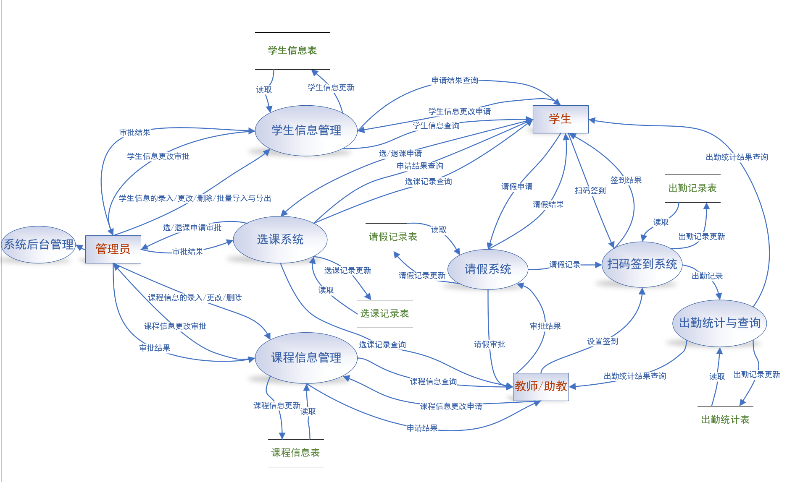
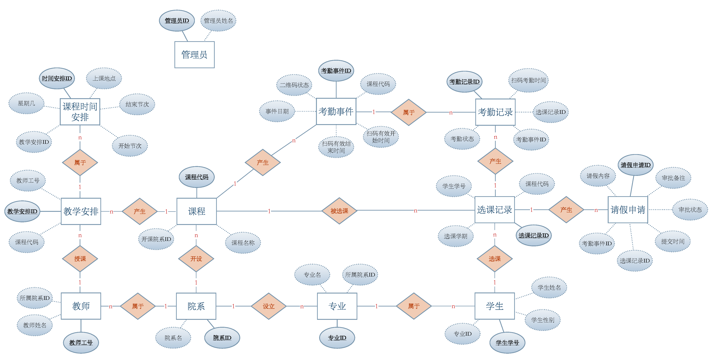

# 微信扫码考勤系统 期末项目文档

2024-2025学年春季学期 数据库及实现  
https://github.com/hA0oooooo/WeChat_QR_Scanning_Attendance_System

### 0. 小组成员: 
**洪家权**：主要负责微信接口，编写视图函数，实现核心业务逻辑，设计用户界面，优化测试模块，撰写安装部署文档  
**陈皓阳**：主要负责数据库逻辑设计，设计及优化用户界面，优化业务逻辑，设计测试模块，撰写数据库设计文档  
**盖烈森**：主要负责需求分析，逻辑设计，系统测试，优化测试模块，用户手册撰写，PPT制作，期中汇报，期末展示  
**马静**：主要负责数据库逻辑设计，需求分析和概念设计的可视化，系统测试，用户手册撰写，期中汇报，期末展示  


### 1. 项目概述

随着信息技术在教育领域的广泛应用，传统的人工点名方式在效率、准确性和数据管理方面日益显现出不足。在高校中，对大规模课程进行快速、准确、便捷的考勤管理成为了迫切的需求。本项目——"微信扫码点名系统"——旨在构建一套自动化的考勤管理解决方案。

本系统利用微信平台的用户基础，及其扫码接口作为前端签到入口；核心数据，包括学生、课程、教师、考勤及请假记录等，将由后端应用程序依赖健壮的关系数据库进行高效、安全的存储与管理；同时，系统提供 Web 前端界面，支持各类用户（学生、教师、管理员）进行信息查询、管理操作（增删改）等交互，并能直观地展示所需的考勤统计结果。通过整合这些技术，期望能显著提升考勤效率，减少人为错误，并为教学管理提供有效的数据支持。


### 2. 系统需求分析

本系统围绕学生、教师和管理员三类用户的交互展开，满足他们在考勤、教学、管理等方面的核心需求，并需要对相关的核心数据进行有效管理。


##### 2.1 数据流图



##### 2.2 用户角色及核心功能


**学生 (Student):**

* **扫码签到:** 通过微信在教师发起的考勤事件有效时间内扫描二维码完成签到，系统记录扫码时间和出勤状态。
* **请假申请:** 针对特定考勤事件提交请假申请，填写请假理由，系统记录提交时间并等待教师审批。
* **考勤查询:** 查看个人考勤记录，包括出勤、缺勤、请假状态及统计数据（出勤率、缺勤次数等）。
* **课程信息查询:** 查看已选修课程列表、课程详情、上课时间地点等信息。
* **请假申请:** 查看历史请假申请记录及审批状态（待审批、已通过、已驳回）。
* **个人信息管理:** 查看和修改个人基本信息，修改登录密码。


**教师 (Teacher):**

* **二维码展示:** 系统为有效的考勤事件自动生成二维码，教师可展示给学生扫码签到。
* **考勤结果查看:** 实时查看考勤事件的学生签到情况，包括出勤、缺勤、请假名单。
* **请假审批:** 审核学生提交的请假申请，进行批准或驳回操作，添加审批备注。
* **学生考勤统计:** 查看执教课程中单个学生在指定课程的全部考勤记录和统计数据。
* **课程考勤统计:** 查看执教课程整体考勤情况，即各次考勤事件的出勤率统计。
* **个人信息管理:** 查看和修改个人基本信息，修改登录密码。


**管理员 (Admin):**

* **基础信息管理:** 管理院系、专业、学生、教师、课程等基础信息的增删改查。
* **教学安排管理:** 管理教师与课程的教学任务分配（TeachingAssignment），设置具体的课程时间安排（ClassSchedule）。
* **选课管理:** 管理学生的选课记录（Enrollment），为学生添加选课、删除选课记录。
* **数据统计查询:** 查看全系统考勤数据统计，包括各课程出勤率、学生考勤情况等统计报表。


##### 2.3 主要数据需求

为实现上述功能，数据库需要存储和管理以下核心信息：

* **组织与人员:** 院系 (Department)、专业 (Major)、学生 (Student)、教师 (Teacher)、管理员 (Admin) 的基本信息。
* **课程与教学:** 课程 (Course) 的基本信息、教师与课程之间的教学安排 (TeachingAssignment)、该安排下的具体上课时间表 (ClassSchedule)。
* **考勤核心流程:**
    * 特定日期为某课程发起的考勤事件 (AttendanceEvent)，包含有效时间窗口和状态。
    * 学生针对某次考勤事件的最终考勤记录 (Attendance)，包含状态和扫码时间（如果出勤）。
    * 学生针对某次考勤事件提交的请假申请 (LeaveRequest)，包含原因、提交时间和审批信息。


### 3. 数据库概念模型设计

##### 3.1 E-R 图 (Entity-Relationship Diagram)


* 真实模型较上述图片略有修改

##### 3.2 经规范化的实体列表 (Entity List)

1.  **院系 (Department):** 院系ID (PK), 院系名
2.  **专业 (Major):** 专业ID (PK), 专业名, 所属院系ID (FK)
3.  **学生 (Student):** 学生学号 (PK), 学生姓名, 学生性别, 学生专业ID (FK), 微信openid, 关联用户账号ID (FK)
4.  **课程 (Course):** 课程代码 (PK), 课程名称, 开课院系ID (FK)
5.  **教师 (Teacher):** 教师工号 (PK), 教师姓名, 所属院系ID (FK), 关联用户账号ID (FK)
6.  **选课记录 (Enrollment):** 选课记录ID (PK), 学生学号 (FK), 课程代码 (FK)
7.  **考勤记录 (Attendance):** 考勤记录ID (PK), 选课记录ID (FK), 考勤事件ID (FK), 扫码考勤时间, 考勤状态, 备注
8.  **请假申请 (LeaveRequest):** 请假申请ID (PK), 选课记录ID (FK), 考勤事件ID (FK), 请假内容, 提交时间, 审批状态, 审批备注, 审批教师工号 (FK), 审批时间
9.  **考勤事件 (AttendanceEvent):** 考勤事件ID (PK), 课程代码 (FK), 考勤日期, 扫码开始时间, 扫码结束时间, 事件状态, 二维码内容, 二维码过期时间
10. **教学安排 (TeachingAssignment):** 教学安排ID (PK), 教师工号 (FK), 课程代码 (FK)
11. **课程时间安排 (ClassSchedule):** 时间安排ID (PK), 教学安排ID (FK), 上课日期, 星期几, 开始节次, 结束节次, 上课地点


##### 3.3 关系描述 (Relationship Descriptions)

1.  设立 (院系 1:N 专业)
2.  属于 (专业 1:N 学生)
3.  属于 (院系 1:N 教师)
4.  开设 (院系 1:N 课程)
5.  选课 (学生 1:N 选课记录)
6.  被选课 (课程 1:N 选课记录)
7.  产生 (选课记录 1:N 考勤记录)
8.  产生 (选课记录 1:N 请假申请)
9.  产生 (课程 1:N 考勤事件)
10. 属于 (考勤事件 1:N 考勤记录)
11. 产生 (课程 1:N 教学安排)
12. 授课 (教师 1:N 教学安排)
13. 属于 (教学安排 1:N 课程时间安排)
14. 审批 (教师 1:N 请假申请)
15. 教学安排 (课程 N:M 教师) 
    *注：通过实体 10 教学安排 实现*


### 4. 数据库设计

##### 4.1 数据库技术选型

本系统采用 SQLite 作为数据库管理系统，选择原因如下：
- 轻量化：无需独立的数据库服务器，便于开发和部署
- 兼容性好：Django 对 SQLite 提供完整支持
- 事务支持：支持 ACID 事务特性
- 适合中小规模应用：满足考勤系统的数据量和并发要求

##### 4.2 数据库表结构设计

基于概念模型设计，系统共包含 11 个核心数据表

**4.2.1 人员与组织结构表**

Department（院系表）
- `dept_id` (主键)：院系ID，自增整型
- `dept_name`：院系名称，字符串类型，唯一约束

Major（专业表）
- `major_id` (主键)：专业ID，自增整型
- `major_name`：专业名称，字符串类型，唯一约束
- `dept_id` (外键)：所属院系ID，引用 Department 表

Student（学生表）
- `stu_id` (主键)：学生学号，字符串类型
- `stu_name`：学生姓名，字符串类型
- `stu_sex`：学生性别，整型（1-男，2-女）
- `major_id` (外键)：所属专业ID，引用 Major 表
- `openid`：微信openid，字符串类型，唯一约束
- `user_id` (外键)：关联Django用户账号，引用 auth_user 表

Teacher（教师表）
- `teacher_id` (主键)：教师工号，字符串类型
- `teacher_name`：教师姓名，字符串类型
- `dept_id` (外键)：所属院系ID，引用 Department 表
- `user_id` (外键)：关联Django用户账号，引用 auth_user 表

**4.2.2 课程相关表**

Course（课程表）
- `course_id` (主键)：课程代码，字符串类型
- `course_name`：课程名称，字符串类型
- `dept_id` (外键)：开课院系ID，引用 Department 表

TeachingAssignment（教学安排表）
- `assignment_id` (主键)：教学安排ID，自增整型
- `teacher_id` (外键)：教师工号，引用 Teacher 表
- `course_id` (外键)：课程代码，引用 Course 表
- 联合唯一约束：(teacher_id, course_id)

ClassSchedule（课程时间安排表）
- `schedule_id` (主键)：时间安排ID，自增整型
- `assignment_id` (外键)：教学安排ID，引用 TeachingAssignment 表
- `class_date`：上课日期，日期类型
- `weekday`：星期几，整型（1-7）
- `start_period`：开始节次，整型
- `end_period`：结束节次，整型
- `location`：上课地点，字符串类型

**4.2.3 考勤核心表**

Enrollment（选课记录表）
- `enroll_id` (主键)：选课记录ID，自增整型
- `stu_id` (外键)：学生学号，引用 Student 表
- `course_id` (外键)：课程代码，引用 Course 表
- 联合唯一约束：(stu_id, course_id)

AttendanceEvent（考勤事件表）
- `event_id` (主键)：考勤事件ID，自增整型
- `course_id` (外键)：课程代码，引用 Course 表
- `event_date`：考勤日期，日期类型
- `scan_start_time`：扫码开始时间，日期时间类型
- `scan_end_time`：扫码结束时间，日期时间类型
- `status`：事件状态，整型（1-有效，2-无效）
- `qr_code`：二维码内容，字符串类型
- `qr_code_expire_time`：二维码过期时间，日期时间类型

Attendance（考勤记录表）
- `attend_id` (主键)：考勤记录ID，自增整型
- `enroll_id` (外键)：选课记录ID，引用 Enrollment 表
- `event_id` (外键)：考勤事件ID，引用 AttendanceEvent 表
- `scan_time`：扫码时间，日期时间类型（可为空）
- `status`：考勤状态，整型（1-出勤，2-缺勤，3-请假，4-未开始）
- `notes`：备注，文本类型
- 联合唯一约束：(enroll_id, event_id)

LeaveRequest（请假申请表）
- `leave_request_id` (主键)：请假申请ID，自增整型
- `enroll_id` (外键)：选课记录ID，引用 Enrollment 表
- `event_id` (外键)：考勤事件ID，引用 AttendanceEvent 表
- `reason`：请假理由，文本类型
- `submit_time`：提交时间，日期时间类型
- `approval_status`：审批状态，整型（1-待审批，2-已批准，3-已驳回）
- `approver_teacher_id` (外键)：审批教师工号，引用 Teacher 表
- `approval_timestamp`：审批时间，日期时间类型
- `approver_notes`：审批备注，文本类型
- 联合唯一约束：(enroll_id, event_id)

##### 4.3 数据库完整性约束

1. 实体完整性：所有表都定义了主键约束
2. 参照完整性：所有外键都设置了适当的删除策略
   - `CASCADE`：级联删除（如删除选课记录时删除相关考勤记录）
   - `RESTRICT`：限制删除（如院系被课程引用时不允许删除）
   - `SET_NULL`：设置为空（如教师离职时请假审批记录保留但审批者设为空）
3. 用户自定义完整性：
   - 学号、教师工号、微信openid 等关键字段设置唯一约束
   - 性别、考勤状态等字段使用枚举值约束
   - 联合唯一约束防止重复选课、重复考勤记录等

##### 4.4 数据库索引设计

Django ORM 自动为以下字段创建索引：
- 所有主键字段
- 所有外键字段  
- 设置 `unique=True` 的字段

这些索引能够有效支持系统的查询需求，如按学生查询考勤记录、按课程查询考勤事件等


### 5. 功能设计、模块划分与系统实现

##### 5.1 技术架构

本系统采用 **Django MVT（Model-View-Template）** 架构

后端框架：
- Django 4.2.20：Web 应用框架
- SQLite：嵌入式数据库
- Django ORM：对象关系映射

前端技术：
- HTML + CSS：前端页面
- Django 模板系统

第三方服务：
- 微信公众平台：用户认证和消息推送
- 花生壳：实现内网穿透
- QRCode 库：二维码生成
- Pillow：图像处理

##### 5.2 系统模块划分

**5.2.1 数据模型层（Models）**

文件： `attendance/models.py`

包含 11 个核心数据模型，实现数据的定义和基本操作：
- 组织和人员架构模型：Department, Major, Student, Teacher
- 课程管理模型：Course, TeachingAssignment, ClassSchedule
- 选课和考勤模型：Enrollment, AttendanceEvent, Attendance, LeaveRequest


**5.2.2 视图层（Views）**

文件结构： `attendance/views/`
- `admin_views.py`：管理员功能视图
- `teacher_views.py`：教师功能视图  
- `student_views.py`：学生功能视图
- `wechat_views.py`：微信相关视图
- `wechat_notify.py`：微信消息处理

功能实现：
- 基于角色的权限控制：不同角色用户访问对应功能模块
- 会话管理：基于 Django Session 实现用户登录状态管理
- 异常处理：统一的错误处理和响应机制


**5.2.3 模板层（Templates）**

文件结构： `attendance/templates/`
- `base.html`：基础模板，定义通用页面结构
- `admin/`：管理员页面模板
- `teacher/`：教师页面模板
- `student/`：学生页面模板

设计特点：
- 模板继承：基于 `base.html` 的多层模板继承
- 组件化设计：可复用的页面组件
- 数据绑定：Django 模板语言实现动态内容渲染

**5.2.4 业务服务层（Services）**

文件： `attendance/services/wechat_service.py`

微信集成服务：
- 消息处理：处理微信服务器推送的消息和事件
- 签名验证：验证微信服务器请求的合法性

##### 5.3 核心功能实现

**5.3.1 二维码考勤**

1. 教师端：创建考勤事件 → 系统生成二维码 → 展示二维码
2. 学生端：微信扫码 → 验证有效性 → 记录考勤状态
3. 数据处理：实时更新考勤记录 → 生成统计报表

技术实现：
- 使用 `qrcode` 库生成包含事件ID和时间戳的二维码
- 二维码内容加密处理，防止伪造
- 设置扫码时间窗口，过期自动失效

**5.3.2 请假审批**

1. 学生提交请假申请（待审批状态）
2. 相关教师页面发生变化
3. 教师审批（批准/驳回）
4. 自动更新考勤记录状态
5. 学生页面显示审批结果

**5.3.3 数据统计与报表**

1. 个人统计：学生个人出勤率、缺勤次数
2. 课程统计：课程整体出勤情况、各次考勤分析
3. 教师统计：教师所授课程的考勤汇总
4. 系统统计：全校考勤数据分析

技术实现：
- Django ORM 聚合查询
- Chart.js 图表展示（饼图、柱状图、环形图）


##### 5.4 系统特色

1. 微信生态集成：充分利用微信用户基础
2. 智能状态管理：自动处理考勤状态转换和异常情况
3. 多角色权限设计：精细化的权限控制，满足不同用户需求
4. 数据可视化：直观的统计图表，支持教学决策


### 6. 项目目录结构

```
WeChat_QR_Scanning_Attendance_System/
├── attendance/                         # 主应用模块
│   ├── migrations/                     # 数据库迁移文件
│   ├── models.py                       # 数据模型定义
│   ├── services/                       
│   │   └── wechat_service.py           
│   ├── templates/                      ### 网页
│   │   ├── admin/                      # 管理员页面模板
│   │   ├── student/                    # 学生页面模板
│   │   ├── teacher/                    # 教师页面模板
│   │   ├── base.html                   # 基础模板
│   │   ├── index.html                  # 首页模板
│   │   └── login.html                  # 登录页面模板
│   ├── templatetags/                  
│   │   └── attendance_filters.py       # 时间转换过滤器
│   ├── views/                          ### 视图
│   │   ├── admin_views.py              # 管理员视图
│   │   ├── student_views.py            # 学生视图
│   │   ├── teacher_views.py            # 教师视图
│   │   ├── wechat_views.py             # 微信相关
│   │   └── wechat_notify.py            
│   ├── urls.py                         
│   └── utils.py                        
├── attendance_system/                  # Django项目配置
│   ├── settings.py                     # 主配置文件
│   ├── urls.py                         # URL配置
│   ├── asgi.py                         
│   └── wsgi.py                        
├── Document/                           ### 项目文档
│   ├── source/                         
│   ├── 安装部署文档.pdf                
│   ├── 数据库设计文档.pdf              
│   └── 用户手册.pdf                   
├── tests/                              ### 测试与导入数据
│   ├── test_data_initialization.py     # 测试数据初始化
│   └── test_utilities.py               # 测试工具函数
├── init_test_data.py                   # 测试数据导入脚本
├── setup_wechat_demo.py                # 微信功能配置脚本 
├── manage.py                           # Django管理脚本
├── requirements.txt                    # 项目依赖
└── README.md                           # 项目说明
```

