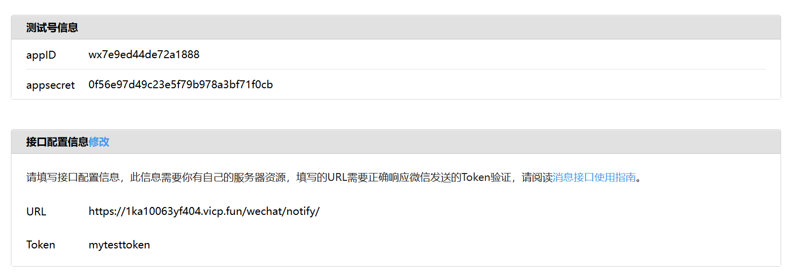
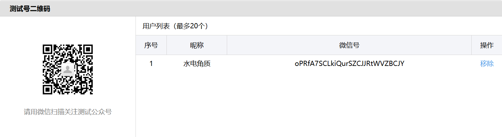
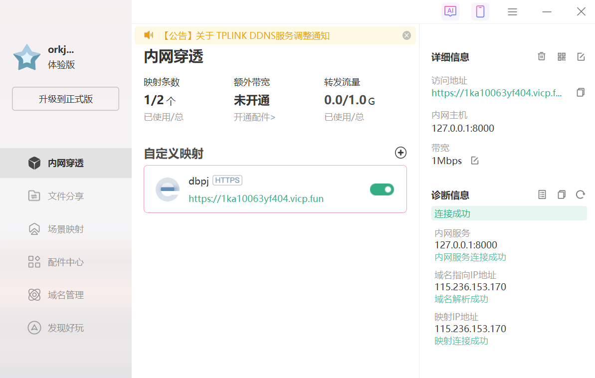
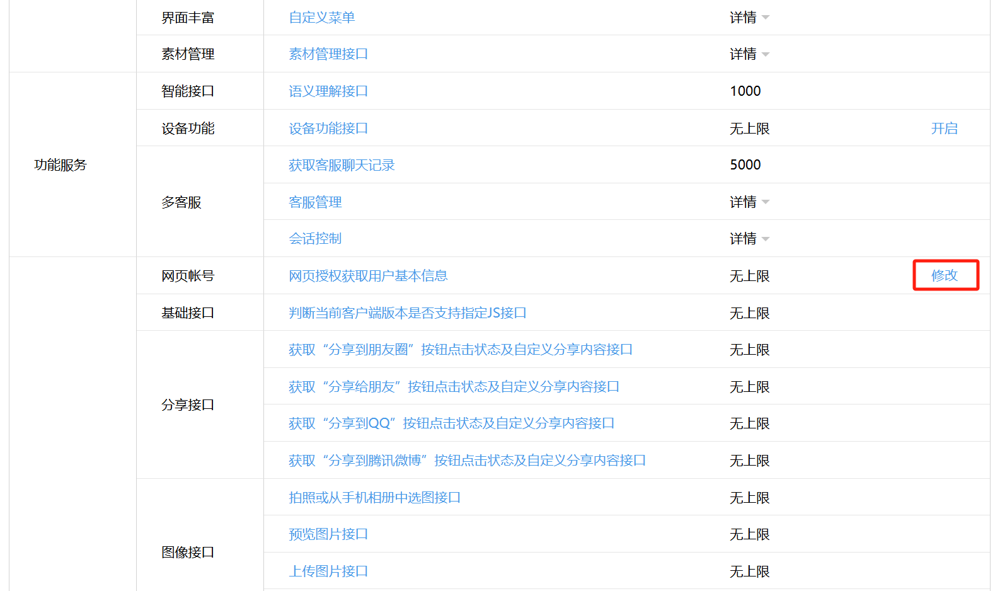
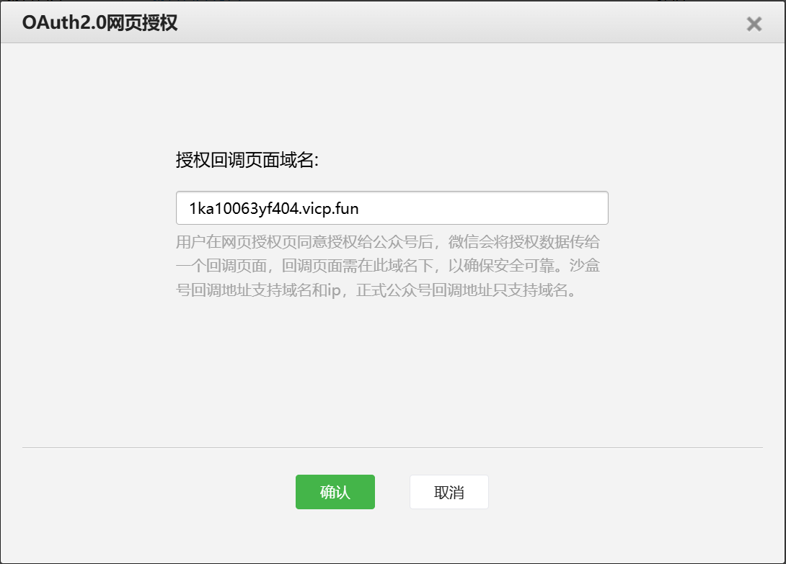

# 微信扫码考勤系统 - 安装部署文档

### 1. 环境要求

操作系统
* Windows 11

编程语言及版本
* Python 3.9.23
* 包及虚拟环境管理器 Anaconda3

主要依赖包
* Django==4.2.20
* qrcode==8.0
* Pillow==10.4.0
* requests==2.32.3
* pytz==2024.1 

数据库
* SQLite

其他必要工具
* 微信公众号测试号（关联扫码功能）
* 内网穿透工具（花生壳）
* git 源代码管理


### 2. 依赖包安装

```bash
conda install --file requirements.txt
```
* 笔者使用 Anaconda 环境管理工具


### 3. 本地体验模式

如果您只想查看系统界面和基本功能，无需微信配置：

##### 3.1 初始化数据库

```bash
# 数据库迁移
python manage.py migrate
# 导入测试数据 
python init_test_data.py
```

##### 3.2 启动服务

```bash
python manage.py runserver
```

##### 3.3 访问系统

打开浏览器访问：http://127.0.0.1:8000

默认账号：
* 管理员：admin / 1
* 教师：teacher1 / 1
* 学生：23307130001 / 1

### 4. 扫码功能部署

如果您想体验完整的微信扫码功能，需要按以下顺序操作：

##### 4.1 申请微信公众号测试号并获取基本信息

1. 访问微信公众平台测试号：https://mp.weixin.qq.com/debug/cgi-bin/sandbox?t=sandbox/login
2. 扫码登录微信
3. 记录重要信息：
   * appID（测试号信息中的appID）
   * appsecret（测试号信息中的appsecret）
   * 您的微信openid（扫描左侧二维码关注测试号后，在用户列表中获取）

 


* 注意：此时不要填写 URL 接口配置信息，这是因为项目未启动，内网穿透得到的网址无法相应微信的测试信息，最后会导致配置失败。待我们先启动一次项目后，填写完 URL 配置信息，就可以持久地使用扫码功能。

##### 4.2 安装并配置内网穿透

1. 安装花生壳客户端（项目根目录已提供安装文件）
2. 注册并登录花生壳客户端（新用户有两小时免费体验）
3. 添加内网穿透映射：
   * 内网主机：127.0.0.1
   * 内网端口：8000
4. 获取公网访问地址（如：https://1ka10063yf404.vicp.fun/）



##### 4.3 配置系统并启动服务

运行配置脚本：

```bash
python setup_wechat_demo.py
# 该脚本会自动调用 init_test_data.py 导入测试数据
```

按提示输入之前记录的信息：
* 微信 AppID
* 微信 AppSecret  
* 内网穿透地址
* 您的微信 OpenID

脚本将自动更新系统配置并初始化测试数据。

启动系统服务：

```bash
python manage.py runserver
```

确保系统正常运行后再进行下一步。

##### 4.4 配置微信回调URL

系统启动后，返回微信公众平台测试号管理页面：

1. 填写接口配置信息：
   * URL：https://您的内网穿透域名/wechat/notify/（如：https://1ka10063yf404.vicp.fun/wechat/notify/）
   * Token：mytesttoken
   * 点击"提交"按钮进行验证

2. 配置网页授权域名：
   * 找到"体验接口权限表" -> "网页服务" -> "网页账号"
   * 点击"修改"
   * 在"网页授权获取用户基本信息"中填写：您的内网穿透域名（不含https://）




* 至此微信扫码功能配置完成，用户的微信账号可以关联到项目中学生的账号

### 5. 注意事项

* 确保内网穿透工具正常运行
* 微信公众平台配置必须与系统设置一致
* 系统使用模拟时间：2025-06-18 10:00:00
* 扫码功能直接在手机端微信扫描二维码

